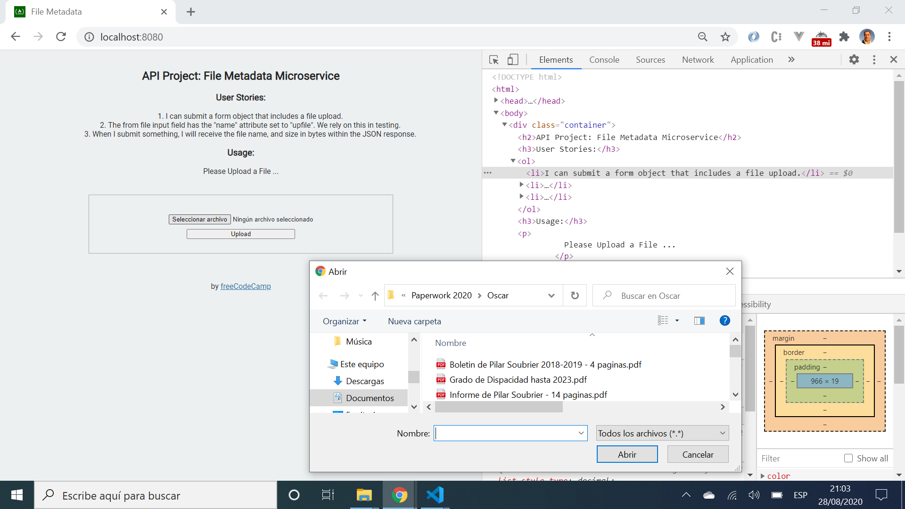

# :zap: File Metadata Microservice for freeCodeCamp

* Creates a url short ID and stores it in a database with the original url
* Adding the shortID in a url address will redirect to the original website
* This was part of the FreeCodeCamp exercises for Front End Certification

*** Note: to open web links in a new window use: _ctrl+click on link_**

## :page_facing_up: Table of contents

* [:zap: File Metadata Microservice for freeCodeCamp](#zap-file-metadata-microservice-for-freecodecamp)
	* [:page_facing_up: Table of contents](#page_facing_up-table-of-contents)
	* [:books: General info](#books-general-info)
	* [:camera: Screenshots](#camera-screenshots)
	* [:signal_strength: Technologies](#signal_strength-technologies)
	* [:floppy_disk: Setup](#floppy_disk-setup)
	* [:computer: Code Examples](#computer-code-examples)
	* [:cool: Features](#cool-features)
	* [:clipboard: Status & To-Do List](#clipboard-status--to-do-list)
	* [:clap: Inspiration](#clap-inspiration)
	* [:envelope: Contact](#envelope-contact)

## :books: General info

* Original instructions (User Stories) from FCC:

1. I can submit a form that includes a file upload.
2. The from file input field  has the "name" attribute set to "upfile". We rely on this in testing.
3. When I submit something, I will receive the file name and size in bytes within the JSON response
4. To handle the file uploading you should use the [multer](https://www.npmjs.com/package/multer) npm package.

## :camera: Screenshots

.

## :signal_strength: Technologies

* [Node v12](https://nodejs.org/en/) javaScript runtime built on Chrome's V8 JavaScript engine
* [Express v5](https://expressjs.com/) Fast, unopinionated, minimalist web framework for Node.js
* [multer v1](https://www.npmjs.com/package/multer) node.js middleware for handling multipart/form-data, mainly used for uploading files
* [Cors v2](https://www.npmjs.com/package/cors) node.js package for providing Connect/Express middleware that can be used to enable CORS with various options.

## :floppy_disk: Setup

* Run `node server.js` for a dev server. Navigate to `http://localhost:8080/`.
* The app will not automatically reload if you change any of the source files.

## :computer: Code Examples

* extract from `server.js` to upload file and produce a json object with file details (or error message if it does not work)

```javascript
app.post('/api/fileanalyse', upload.single('upfile'), (req, res, next) => {
	const fileSize = req.file && req.file.size;
	console.log(typeof fileSize); //should return 'number'
	res.json(
		typeof fileSize == 'undefined'
			? { error: 'sorry, but there is a file error' }
			: {
					name: req.file.originalname,
					type: req.file.mimetype,
					size: req.file.size + ' bytes',
			  }
	);
});
```

## :cool: Features

* multer used to upload files - uploaded files stored in a folder named 'uploads'. If this folder does not exist then it is created.

## :clipboard: Status & To-Do List

* Status: Working
* To-Do: nothing

## :clap: Inspiration

* [freeCodeCamp's APIs and Microservices Projects - File Metadata Microservice](https://www.freecodecamp.org/learn/apis-and-microservices/apis-and-microservices-projects/file-metadata-microservice)

## :envelope: Contact

* Repo created by [ABateman](https://www.andrewbateman.org) - you are welcome to [send me a message](https://andrewbateman.org/contact)
